{w=32}

# 北科 AR 校園導覽:LLM 導遊與 AI 互動體驗

### 結合 Geospatial AR、大型語言模型與強化學習的北科校園導覽應用

**課程**:電腦圖學與擴增實境(NTUT 創新 AI 所)
**組員**:潘柏嘉、簡妤真、張凱琳、蔡宗育
**日期**:2026 年 6 月

**Demo 影片**:[https://youtu.be/p-2S3pdHWJw](https://youtu.be/p-2S3pdHWJw)

**App 下載 / 試用 / 原始碼**
- 　iOS(TestFlight 公開測試):[https://testflight.apple.com/join/GFagNNEY](https://testflight.apple.com/join/GFagNNEY)
- 　Android(APK)/ 版本發佈:[https://github.com/poterpan/ntut-ar-campus-tour/releases/tag/v1.0.0](https://github.com/poterpan/ntut-ar-campus-tour/releases/tag/v1.0.0)
- 　原始碼(GitHub,公開):[https://github.com/poterpan/ntut-ar-campus-tour](https://github.com/poterpan/ntut-ar-campus-tour)

---

## 摘要

本專案開發一款以**北科大實體校園**為場域的擴增實境(AR)導覽 App。使用者沿著「新生南路側門」進入校園的實際路徑行走,App 透過 **Google ARCore Geospatial(VPS 視覺定位)** 取得公分至公尺級的高精度全球座標,在真實世界對應位置上錨定(anchor)五個校園興趣點(POI)。當使用者走近某個 POI,虛擬導遊 NPC「老黃」會現身、開口導覽,並可透過**大型語言模型(LLM)即時對話**、**語音問答(TTS / STT)** 與使用者互動。此外,App 內含一個以**強化學習(Q-Learning)** 訓練的「AR 校園貓」彩蛋,呼應課程「包含一個訓練出來的 NPC」的要求。

整個專案採模組化(asmdef)架構,功能拆分為 POI 資料層、AR 定位、虛擬導遊、LLM/語音、AR 貓 RL 與 UI 等模組,並建立 **iOS(TestFlight)與 Android 雙平台的 CI/CD 自動建置管線**。本文涵蓋完整的系統架構、四大核心功能實作、工程實踐、開發過程中遭遇的問題與解決方案,以及對設計取捨與未來方向的討論。

<!-- pagebreak -->

## 目錄

[TOC]

<!-- pagebreak -->

# 一、緒論

## 1.1 動機

校園導覽長期仰賴紙本地圖、靜態看板或人力導覽,存在三個典型痛點場景:

1. **新生迷路**:剛入學的新生對校園不熟,面對密集的教學大樓常找不到目的地。
2. **訪客與招生**:校慶、招生說明會時,外賓需要能自助、即時、有溫度的導覽。
3. **校園探索**:一般使用者希望以更有趣、遊戲化的方式認識校園。

傳統行動導覽多以 GPS 定位為基礎,但**消費級 GPS 在都市高樓間的水平誤差可達 5–15 公尺**,在建築物密集的校園中,常無法分辨使用者究竟站在哪一棟樓前,難以做到「走到哪、講到哪」的精準導覽。本專案因此選用 **ARCore Geospatial(VPS 視覺定位)**,結合 LLM 對話與 AR 視覺呈現,打造一個「精準、即時、可互動」的智慧導覽體驗。

## 1.2 目標

- 在真實校園中,以 AR 將虛擬導遊與導覽資訊**精準錨定**在實體地標上。
- 提供**自然語言對話**式導覽,使用者能用文字或語音向導遊提問,獲得該地標的專屬解說。
- 加入一個以機器學習**訓練出來的 NPC**(AR 校園貓),呼應課程要求並提升趣味性。
- 完成可實機運行的 **iOS / Android 雙平台** App,並建立自動化建置流程。

## 1.3 場域

選定**北科大新生南路側門入口路徑**作為導覽場域,沿途設置五個 POI:

| # | POI | 說明 |
|---|---|---|
| p01 | 新生南路側門 | 路線起點,鄰近捷運忠孝新生站,訪客/新生主要入口 |
| p02 | 學生餐廳入口 | 光華館美食街與第二/北星大樓餐飲、便利商店、ATM |
| p03 | 演講廳入口 | 第六教學大樓 B1 國際演講廳,大型演講/研討會場地 |
| p04 | 第一教學大樓 | 一般課程、語言中心、工程學院相關資源 |
| p05 | 化工館 | 化學工程與生物科技系教學研究空間 |

> 實地共收集 8 個座標點(含備用點),正式路線採用其中 5 點。

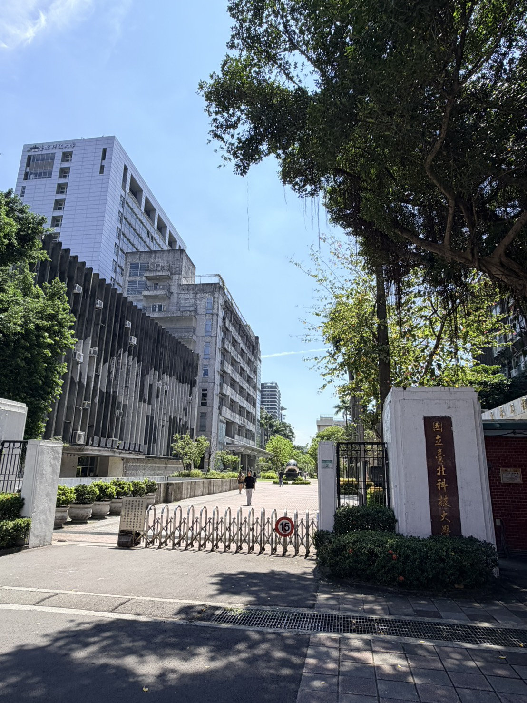

## 1.4 團隊分工

本專案由四位組員共同完成。我們依四大核心功能與整體工程整合進行分工,每位成員主責一個面向,從設計、實作到本報告對應章節的撰寫皆由其負責,並在系統整合階段共同協作:

- **潘柏嘉**:專案整體規劃與系統架構;AR 定位導覽(ARCore Geospatial、anchor 與接近觸發);以及跨平台工程整合與 CI/CD 自動化建置。
- **簡妤真**:虛擬導遊 NPC(角色、動畫狀態機與解說流程);以及全 App 的 UI/UX 設計(Figma 設計稿與暖色玻璃擬態設計系統)。
- **張凱琳**:LLM 即時對話(prompt 設計與穩定性);以及語音 pipeline(GLM TTS、ElevenLabs STT 與簡繁轉換)。
- **蔡宗育**:AR 校園貓與其強化學習(Q-Learning 設計與離線訓練);以及成果整理與結論。

---

# 二、系統架構

## 2.1 三層架構

系統分為**手機端(Client)、雲端服務(Cloud)、訓練端(Training)** 三層:手機端負責 AR 呈現與互動,透過 HTTPS 呼叫雲端的定位、語言與語音服務;校園貓的強化學習模型則在 Editor 中離線訓練,產出 Q-table 供 App 端側查表使用。

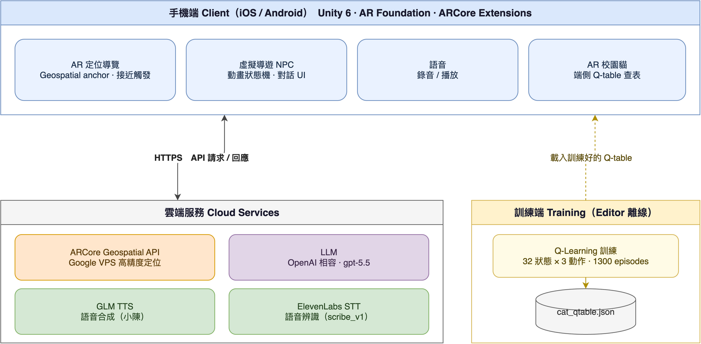

## 2.2 技術選型

| 層面 | 技術 | 選用理由 |
|---|---|---|
| 引擎 | Unity 6(6000.3.10f1) | 跨平台 AR、團隊熟悉 |
| AR 框架 | AR Foundation 6 + ARCore Extensions 1.54.0 | 單一 codebase 同時支援 iOS / Android |
| 高精度定位 | ARCore Geospatial(VPS) | 公分–公尺級,遠優於 GPS 的 5–15m |
| LLM | OpenAI 相容 endpoint(gpt-5.5) | 介面標準、易抽換供應商 |
| TTS | GLM `glm-tts`(音色 xiaochen/小陳) | 中文自然度佳 |
| STT | ElevenLabs `scribe_v1` | 中文辨識準確 |
| 簡繁轉換 | OpenCC s2tw 詞典(端側) | 修正雲端服務輸出的簡體與用詞差異 |
| 強化學習 | Tabular Q-Learning(端側查表) | 輕量、零額外相依,適合此低維單一目標任務 |

## 2.3 模組化架構(asmdef)

為利於團隊分工、降低編譯耦合與場景合併衝突,程式碼以 **Assembly Definition(asmdef)** 切分為五個模組:

| 模組 | 資料夾 | 職責 | 主要相依 |
|---|---|---|---|
| **NtutAR.Poi** | `Scripts/Poi/` | POI 資料模型、解析、查詢(最近點) | (基礎層,無相依) |
| **NtutAR.Geo** | `Scripts/Geo/` | Geospatial 定位、anchor 解析、接近觸發 | Poi、Guide、Ui、ARCoreExtensions |
| **NtutAR.Guide** | `Scripts/Guide/` | 導遊 NPC、LLM 對話、語音 TTS/STT | Poi、TextMeshPro |
| **NtutAR.Cat** | `Scripts/Cat/` | 召喚貓、放飼料、Q-Learning agent | ARFoundation、UI |
| **NtutAR.Ui** | `Scripts/Ui/` | 開場 / HUD / POI 抽屜 / 探索手帳 | Poi、Cat、Guide、TextMeshPro |

> 相依關係:`Poi` 為最底層被多數模組引用;`Geo` 作為整合層串接 Poi/Guide/Ui;`Cat` 與導覽主線解耦(獨立彩蛋)。

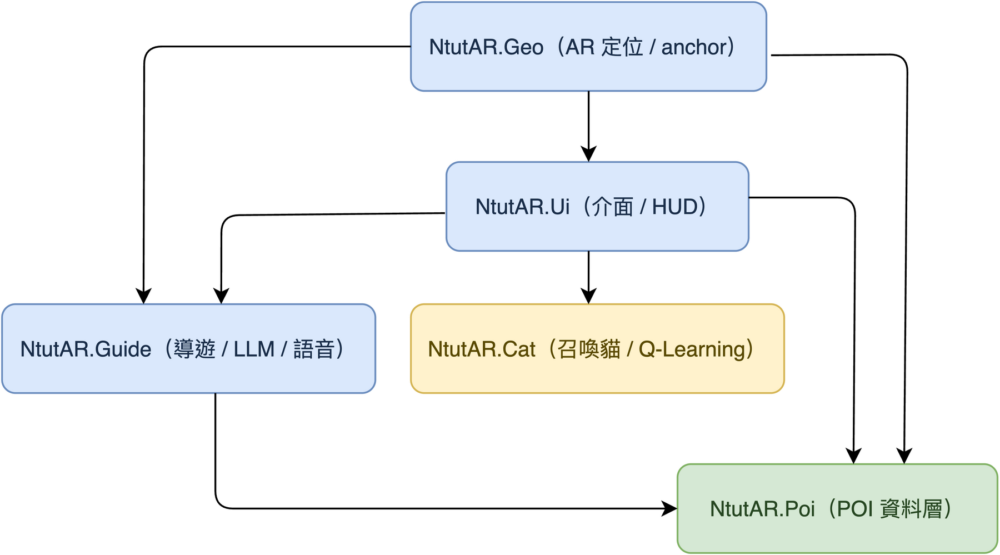

## 2.4 四大核心功能總覽

1. **AR 定位導覽**:VPS 高精度定位 + POI anchor + 接近觸發。
2. **虛擬導遊 NPC**:Jenson 角色 + 動畫狀態機 + 走近現身解說。
3. **LLM 即時對話與語音**:每棟建築專屬知識 prompt + 文字/語音雙向互動。
4. **AR 校園貓**:Q-Learning 訓練的 NPC,Pokémon Go 式召喚與餵食彩蛋。

---

# 三、核心功能實作

## 3.1 AR 定位導覽(Geospatial)

### 3.1.1 為何選 Geospatial / VPS

ARCore Geospatial API 透過三項資料源融合定位:

1. **GPS / 行動網路**:取得粗略全球座標(誤差數公尺)。
2. **VPS(Visual Positioning System)**:以相機畫面比對 Google 街景累積的特徵點雲,將定位修正至**公分–公尺級**。
3. **裝置 IMU / SLAM**:提供連續、低延遲的姿態追蹤。

實測(提案階段)顯示:**校外開闊處水平誤差 < 0.5 m、校內 < 1 m、方位角誤差 < 1°**,足以分辨使用者站在哪一棟樓前,達成「走到哪、講到哪」。

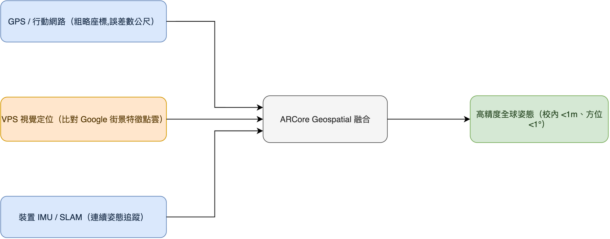

### 3.1.2 POI Anchor 與接近觸發

定位流程與關鍵類別:

- `ArLocalizationController`:監聽 Geospatial 定位就緒(tracking accuracy 達標)。
- `GeospatialAnchorManager`(實作 `IPoiAnchorProvider`):定位完成後,對所有 POI 呼叫 `ResolveAllPois()`,透過 `IAnchorResolver` 在實際經緯度建立地理錨點。
  - `ArCoreAnchorResolver`:實機,使用 Geospatial API 建立 Terrain / Geospatial anchor。
  - `MockAnchorResolver`:Editor 測試用替身(AR 僅能實機驗證)。
- `AnchorRegistry`:以 POI id 為 key 快取已解析的 anchor,並對「解析中(in-flight)」做去重,避免重複建立。
- `ArGuideProximityDriver`:每秒輪詢 `AREarthManager.CameraGeospatialPose`,以 `PoiService.GetNearest()`(Haversine 距離)找最近 POI,若進入 **30 公尺** 範圍即呼叫 `GuideInteractionController.ShowPoiByProximity(poi)` 觸發導遊現身——也就是使用者「走到就現身」的體驗。

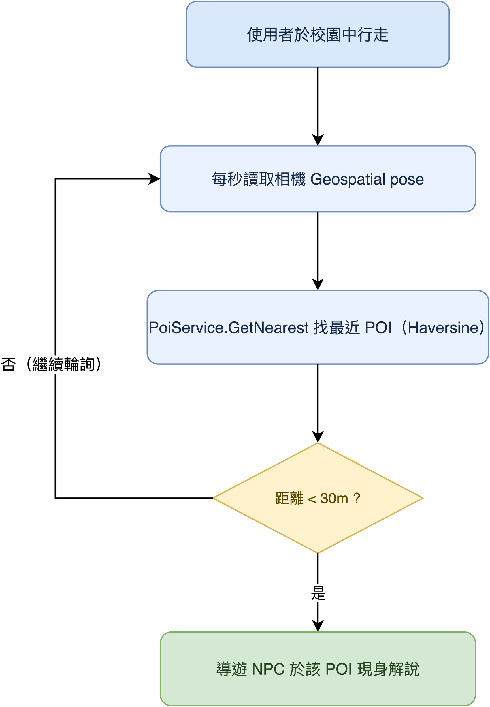

### 3.1.3 跨平台

同一套 AR Foundation + ARCore Extensions 程式碼,在 iOS 經 ARKit provider、在 Android 經 ARCore provider 運行,Geospatial 為兩平台共通能力。

---

## 3.2 虛擬導遊 NPC 與 UI/UX

### 3.2.1 NPC 角色與動畫

導遊 NPC 為 **Jenson**(皮衣眼鏡造型,暱稱「老黃」)。採 Generic rig,具四組動畫:**聆聽(Listening)、說話(Talk)、走動(Walking)、揮手(Wave)**,由 `NpcAnimator` 包裝 Animator,提供 `PlayGreet()` / `PlayListening()` / `PlayTalk()` 等觸發。

**生成式角色製作流程**(此角色非手工建模,而是 AI 生成):

1. 以生成式 AI 產生**角色概念圖**——以「黃仁勳風格」caricature 呈現(皮衣、眼鏡、頭頂一株幼苗,象徵校園與成長);
2. 將概念圖輸入 **Meshy**(image-to-3D)自動生成帶骨架的 biped 3D 模型;
3. 匯入 Unity,套用 Generic rig 與四組動畫,即成為可互動的導遊 NPC。

{w=58}

**綁定踩雷與解決(T-pose 參考圖)**:Meshy 自動生成的模型在**骨骼綁定(rigging)後**,手臂網格會錯誤地被拉扯、沾黏到大腿——動作預覽時手部嚴重變形(如下圖)。我們嘗試多種調整,最後發現關鍵是**在生成階段就輸入一張標準 T-pose(雙臂水平張開)的參考圖**:讓模型以四肢分離的姿勢建模,蒙皮權重(skinning)才能正確區分手臂與軀幹,徹底解決拉扯問題,也才有後續流暢的四組動畫。

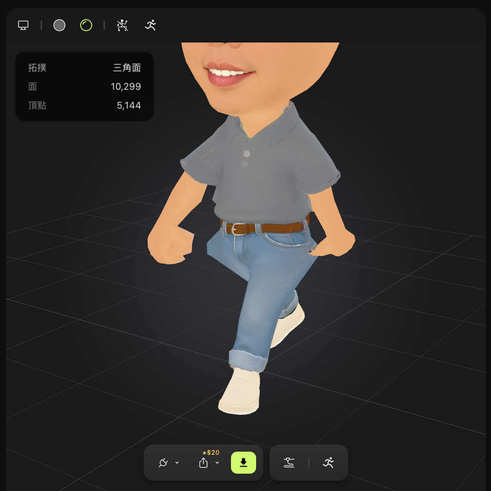{w=68}

關鍵互動類別:

- `GuideInteractionController`:主協調者。在 POI anchor 位置生成 / 銷毀 NPC prefab,將對話委派給 `GuideChatController`,並依對話狀態驅動動畫。NPC **每幀以 `Slerp` 平滑面向相機**(`TickFaceCamera()`,轉速 5),確保導遊永遠看著使用者。
- `GuideChatPanel`:畫面下半的對話面板(玻璃擬態風格),含訊息歷史、輸入框、送出鍵與麥克風鍵,並負責顯示「老黃思考中…」「正在生成語音…」等狀態。

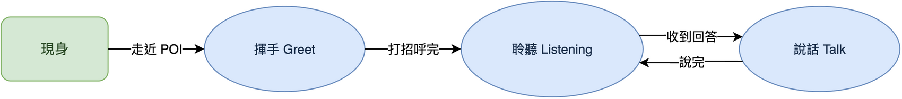

### 3.2.2 對話流程

1. 使用者點擊 NPC → `OpenChat()`,面板開啟、播放揮手動畫。
2. 若該 POI 有開場白(`shortDescription`),自動以語音播報。
3. 使用者輸入問題 → 面板顯示「思考中」並鎖定送出鍵(避免重複送出)→ 呼叫 LLM。
4. LLM 回覆文字先上畫面,接著合成語音播放;播放期間 NPC 切換到「說話」動畫,結束後回到「聆聽」。

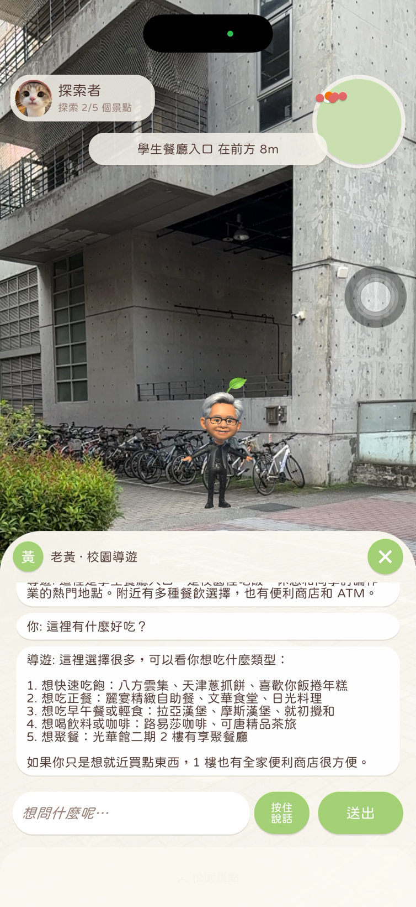{w=56}

### 3.2.3 UI/UX 設計(Figma + 暖色玻璃擬態設計系統)

本節視覺由組員以 **Figma** 設計。App 採「**皮克敏暖色 + 玻璃擬態(glassmorphism)**」設計系統,以程式化 UI builder(`Scripts/Editor/UiBuilder/`)產生 prefab,確保版控可控、風格一致。設計 token(節錄自 `UiPalette`):

| Token | 色值 | 用途 |
|---|---|---|
| GlassFill | #FFFCF5 @ 75% | 玻璃面板底 |
| TextMain | #5D4037(深棕) | 主要文字 |
| ButtonGreen | #AED581 | NPC 徽章、操作鈕 |
| AccentOrange | #F57C00 | 強調色 |
| WarmBg(上/下) | #F7F1E5 / #EDDFC8 | 暖色漸層背景 |

實機畫面(開場 Onboarding / AR HUD / POI 景點抽屜 / 探索手帳):

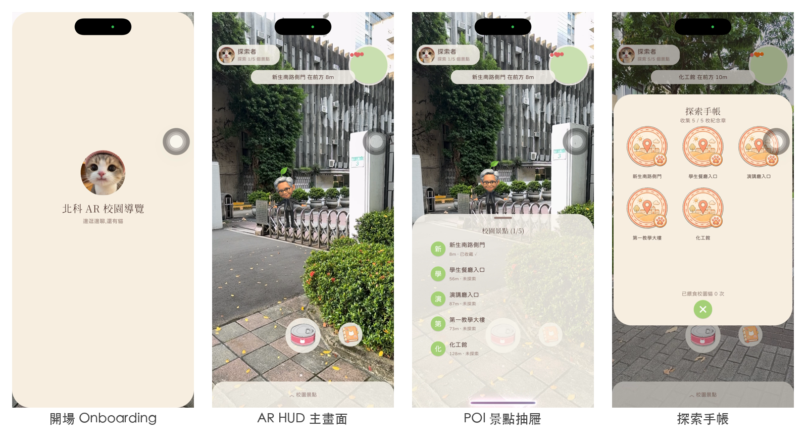

完整 Figma 設計彙整(資訊架構、視覺風格、HUD 配置、各畫面預覽與最終建議方向)如下:

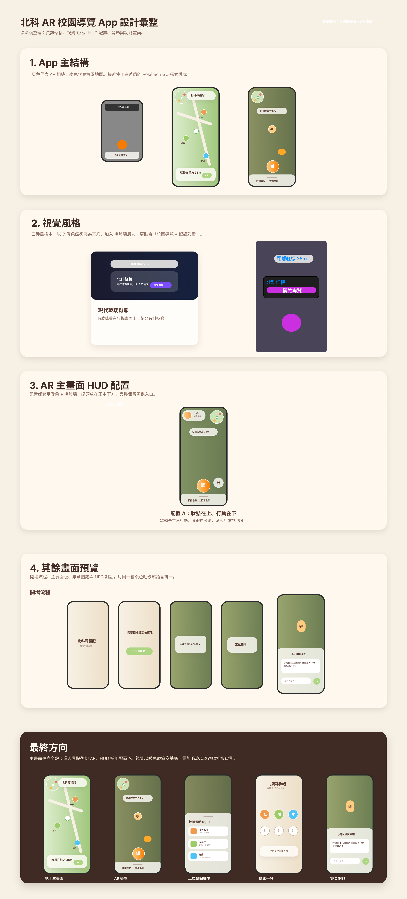{w=96}

　**Figma 互動原型**:[https://www.figma.com/proto/l7W1rVAnNVR8hHfwBFkHPN/AR?node-id=25-2](https://www.figma.com/proto/l7W1rVAnNVR8hHfwBFkHPN/AR?node-id=25-2)

---

## 3.3 LLM 即時對話與語音 pipeline

### 3.3.1 LLM 架構(可抽換)

對話以介面 `ILlmClient` 抽象,具體實作 `OpenAiCompatLlmClient`:

- **模型**:`gpt-5.5`(OpenAI 相容 endpoint)
- **參數**:max tokens 500、timeout 30s
- **設定載入**:金鑰與 URL 來自 `StreamingAssets/llm_config.json`(已加入 `.gitignore`,CI 由 secret 生成),首次提問時延遲載入,缺檔時退回 Inspector 預設。

### 3.3.2 每棟建築專屬知識 Prompt

`LlmPromptBuilder` 依當前 POI 組裝 system prompt,核心規則:

- **資料來源限定**:只能根據該 POI 的 `llmSystemPrompt` 上下文回答,避免幻覺。
- **回答風格**:先直接回答、不照抄整段資料、最多列 6 點、純文字 3–6 句。
- 帶入 `CURRENT_POI_ID / NAME / CONTEXT`,讓每個地標都有專屬的知識上下文。

### 3.3.3 重試與容錯

`LlmRetryPolicy`(純函式、可測試)定義:

- **可重試**:429(限流)、408(逾時)、5xx(伺服器)、code 0(連線錯誤)。
- **不重試**:4xx 客戶端錯誤。
- **退避**:指數退避 1s → 2s → 4s(上限 8s),最多重試 2 次。

任一環節失敗時,導遊改以一句友善訊息回覆:「抱歉,我現在連不上,稍後再試。」

### 3.3.4 語音 pipeline(TTS / STT / 簡繁)

**TTS(念出回答)— `GlmTtsService`**

| 參數 | 值 |
|---|---|
| 模型 / 音色 / 語速 | `glm-tts` / xiaochen(小陳) / 1.3× |
| 格式 | WAV(24 kHz mono) |
| 提示音裁剪 | 以 `WavUtil.FindSpeechStartSample()` 能量偵測(RMS 門檻 0.045、100ms 窗、保留 50ms preroll)裁掉 GLM 免費版前置提示音 |

**STT(按住說話)— `ElevenLabsSttService`**

| 參數 | 值 |
|---|---|
| 模型 | `scribe_v1` |
| 錄音 | 最長 15s、16 kHz mono;按住麥克風鍵錄音、放開即送出辨識 |
| 後處理 | 將辨識結果經簡繁轉換為台灣正體 |

**簡繁轉換 — `ChineseTextUtil`(OpenCC s2tw)**

雲端 STT/LLM 偶爾輸出簡體或非台灣用詞。採內嵌 OpenCC 詞典(`Resources/OpenCC/`)做端側轉換:

1. `STPhrases`:詞組最長匹配(處理「一簡多繁」歧義,如 头发→頭髮 vs 后面→後面)。
2. `STCharacters`:單字回退。
3. `TWVariants`:轉台灣慣用字形(裏→裡、着→著)。
4. 載入失敗時靜默退回原文(graceful degrade)。

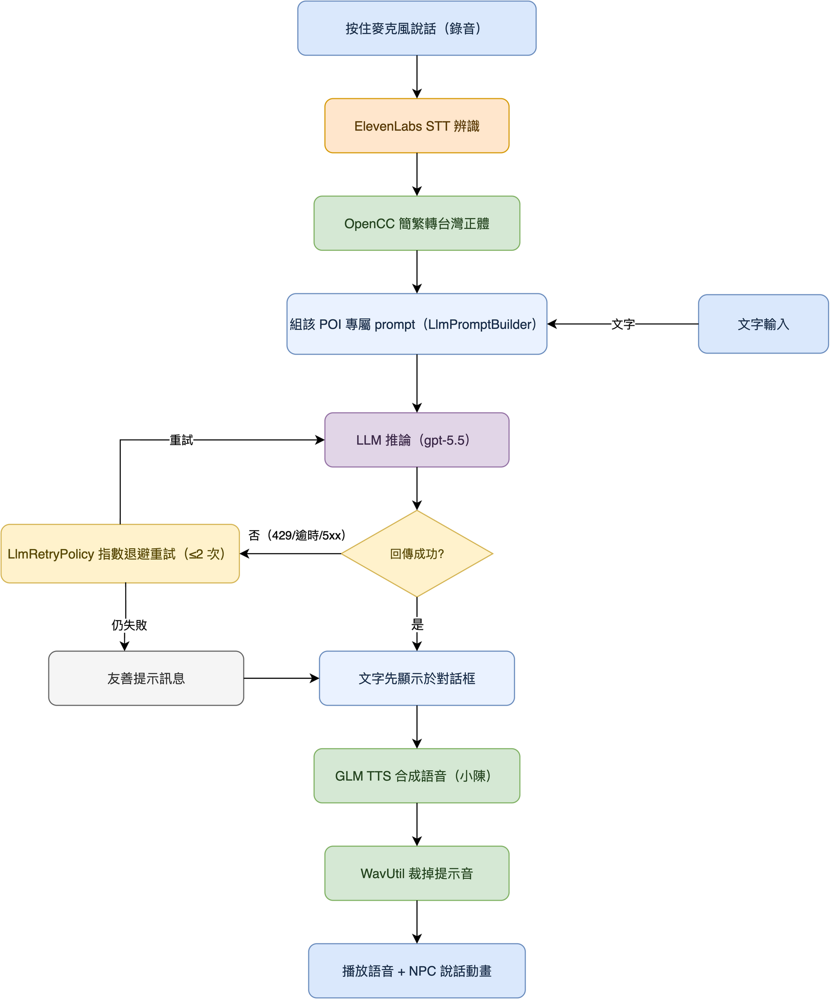

---

## 3.4 AR 校園貓與強化學習

### 3.4.1 互動設計(Pokémon Go 式召喚)

`CatSummonController` 提供全域召喚彩蛋:

1. 點「罐頭」鈕進入放置模式(armed)。
2. 點擊 AR 平面 → 在該處放下飼料罐頭(`SpawnCan`)。
3. 第一個罐頭出現時,貓在約 2.5 m 外現身,自動朝**最近的罐頭**移動。
4. 吃完一個罐頭即銷毀該罐並轉向**下一個最近罐頭**(支援連續多罐頭,`#25`)。
5. 全部吃完後延遲 6 秒消失。

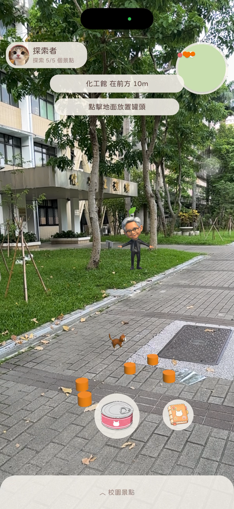{w=56}

### 3.4.2 強化學習設計(Tabular Q-Learning)

校園貓的移動策略以 **表格式 Q-Learning** 訓練(`CatQLearningAgent`)。

**狀態空間(離散,共 32 種)**

以「貓本地座標」描述貓與目標罐頭的相對關係(對位移/旋轉不變,利於學習):

- **距離(4 區間)**:< 2 m、2–4.5 m、4.5–7 m、≥ 7 m。
- **角度(8 區間)**:以貓的前方為基準,將 `SignedAngle` 切成 8 個 45° 扇形(偏移 22.5° 使正前方落在第 0 區)。
- **狀態 ID** = `angleState × 4 + distState`(0 ~ 31)。

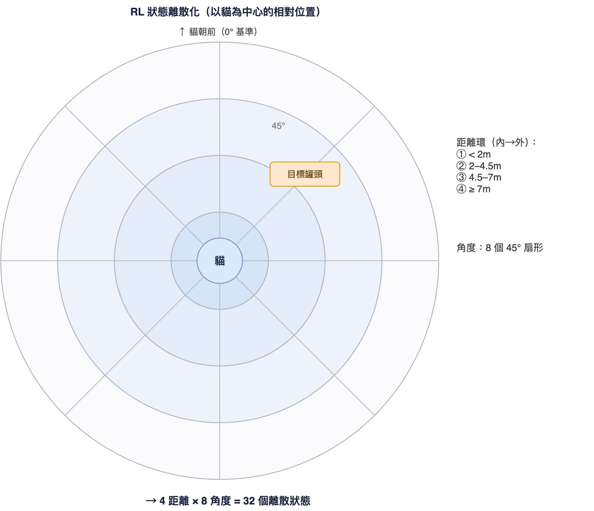

**動作空間(3 種)**

| 動作 | 移動 | 轉向 |
|---|---|---|
| 0 直走 | 1.0 | 0 |
| 1 左轉 | 0.2(仍微前進,避免原地自旋死鎖) | −1.0 |
| 2 右轉 | 0.2 | +1.0 |

**Reward 設計**

```
reward  = (上一步距離 − 當前距離) × 2.0     // 距離 shaping:接近給正、遠離給負
reward += −0.05                            // 時間懲罰:鼓勵走捷徑
reward += +0.02 (朝向 dot > 0.8)           // 對齊獎勵
        / −0.02 (背對 dot < −0.5)
吃到罐頭: +15.0
出界(僅訓練): −10.0 並重置
```

**Q 值更新公式**

```
Q(s,a) ← Q(s,a) + α · [ r + γ · maxₐ' Q(s',a') − Q(s,a) ]
```

**超參數**:學習率 α = 0.1、折扣 γ = 0.9、探索率 ε 由 1.0 依 0.995/episode 衰減至下限 0.05、決策間隔 0.1 s、活動半徑 8 m。

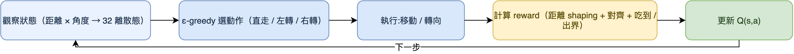

### 3.4.3 訓練與展示

- **訓練(Editor 離線)**:ε-greedy 探索 + 更新 Q 值,每成功 10 次存檔,共訓練 **1300 episodes**,產出 `Assets/ML/cat_qtable.json`(32 狀態 × 3 動作)。
- **展示(主 App)**:`_isTraining = false`,ε = 0 純查表貪婪行動、不更新、不傳送回原點,直接載入訓練好的 Q-table 進行流暢的找罐頭行為。

> 註:選擇 tabular Q-Learning 而非 ML-Agents 是經過評估的設計決策(此任務為低維、單一目標,不需較重的神經網路模型),詳見第八章討論。

---

# 四、POI 資料層與內容

POI 資料採**統一 schema**,集中於 `Assets/Data/poi_data.json`,由 `PoiService` 載入、`PoiDataParser` 解析、`PoiRepository` 提供 Haversine 最近點查詢。

**Schema 欄位**:`id / name / lat / lng / altitude / anchorType / shortDescription(開場白)/ llmSystemPrompt(LLM 上下文)`。

`PoiDataParser` 會驗證:JSON 非空、必含 `pois` 陣列、id 唯一、經緯度非零,並對缺少開場白或 LLM 上下文的項目發出警告;重複 id 保留第一筆並記錄警告。

五個 POI 皆備有實地撰寫的**開場白**與**LLM 上下文**(餐飲店家、系所、空間配置等細節),使導遊的解說與問答貼合北科實際資訊。實地共收集 8 個座標(含備用點),正式採用 5 點。

---

# 五、工程實踐

## 5.1 CI/CD 自動化建置

| 平台 | 流程 |
|---|---|
| **iOS** | game-ci/unity-builder **兩段式**:① Ubuntu 將 Unity 專案匯出為 Xcode 工程 ② macOS 簽名 + 上傳 TestFlight。拆兩段以節省較貴的 macOS 分鐘數。 |
| **Android** | vendor ARCore Extensions、設定 versioning / MinSDK / 權限,正式 `applicationId = me.panspace.ntutartour`、release keystore 簽名,產出 APK(GitHub pre-release)。 |

- **觸發**:推送至 `main` 且動到 `unity-app/` 即自動建置;雙平台皆已設為自動觸發。
- **版號**:`BuildNumberStamper`(`IPreprocessBuildWithReport`)自動以**台北時間 `yyMMdd.HHmm`** 戳記 build number,本地與 CI 同源、單調遞增,免手動 bump,且可從版號讀出建置時間。

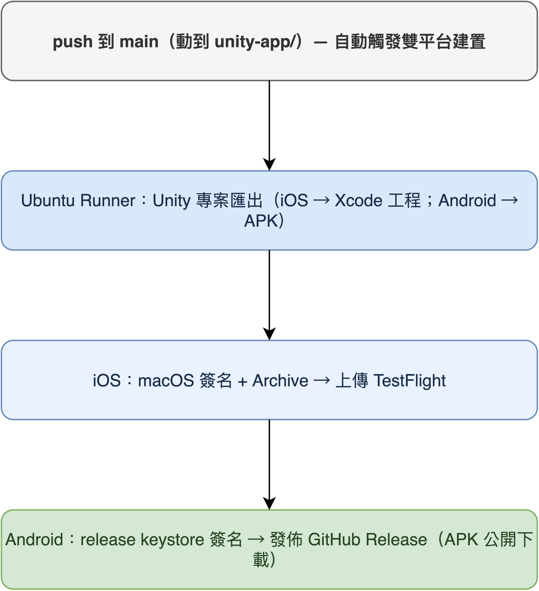

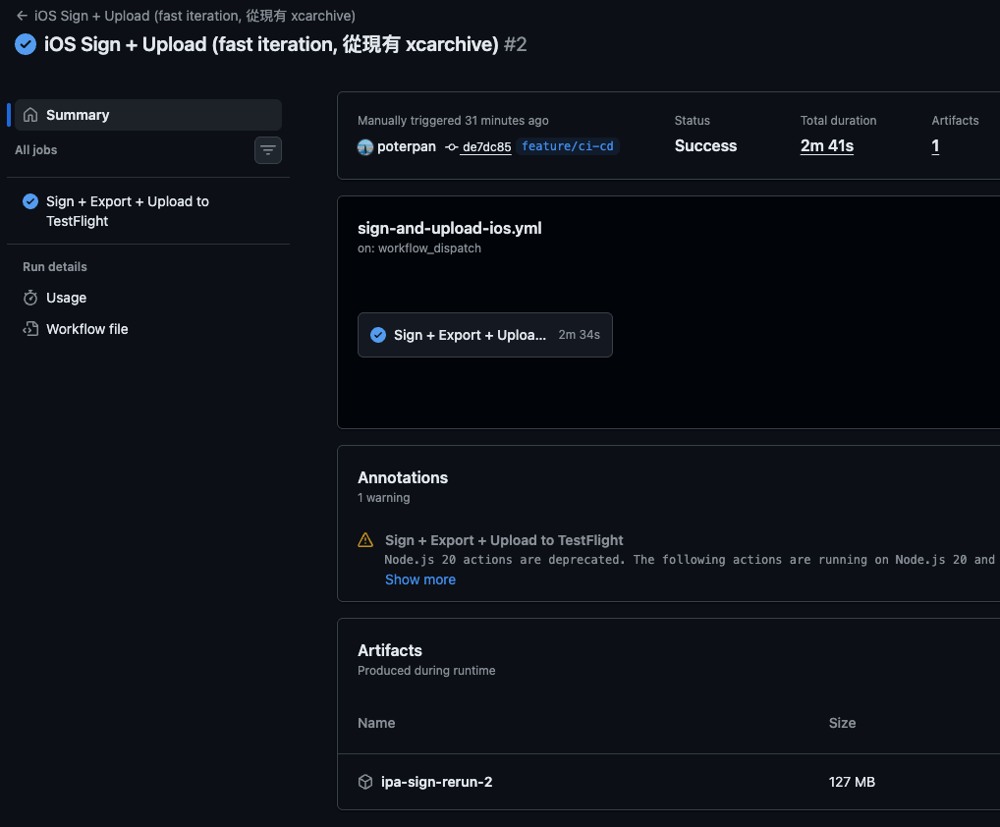

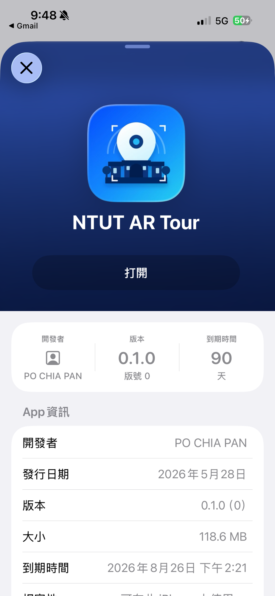

## 5.2 金鑰安全管理

repo 轉為 **Public** 後,金鑰管理尤為關鍵。採三層策略,**絕不將金鑰寫入版控**:

1. **GitHub Secrets**:LLM / GLM / ElevenLabs / ARCore 金鑰皆存於 repo secrets,CI 時注入生成設定檔(`llm_config.json`、ARCore 設定),避免觸發 GitHub 的密鑰外洩警告。
2. **本地 gitignored 設定檔**:開發機保有真實金鑰於 `.gitignore` 的設定檔。
3. **`git skip-worktree`**:對「committed 但內容留空」的金鑰檔(如 ARCore 設定),本地填入真實值並以 `skip-worktree` 避免誤 commit。

## 5.3 跨平台與版控協作

- 單一 codebase 同時建置 iOS / Android。
- 遵循 Unity 版控紀律:Force Text 序列化、可見 .meta 檔、`.meta` 必 commit;功能拆 prefab / 分模組,降低場景合併衝突。
- 分支策略:`main` 穩定、功能於 `feature/*` 開發後開 PR 合併;全程約 **47 個 commit**(見附錄里程碑)。

---

# 六、問題與解決

## 6.1 AR 相機黑屏(乾淨安裝)— 雙重成因

| 項目 | 內容 |
|---|---|
| 症狀 | 自訂 UI 取代 Google 範例的「隱私同意」流程後,乾淨安裝的 App 開啟時不再請求相機權限,且進入後卡在「正在尋找您的位置」、背景全黑。 |
| 成因 | Google Geospatial 範例的隱私同意流程其實同時做**兩件事**,改自訂 UI 後兩件都漏掉:① 請求相機(+ Android 定位)權限;② 呼叫 `SwitchToARView(true)` 啟用 AR Session / Origin / ARCoreExtensions(這三個物件預設 `activeSelf = false`)。`OnEnable` 依 `PlayerPrefs.HasKey("HasDisplayedGeospatialPrivacyPrompt")` 決定是否啟用 AR,key 從未被設 → AR 永不啟用。 |
| 解法 | 新增 `StartupPermissionRequester`(`[RuntimeInitializeOnLoadMethod(BeforeSceneLoad)]` 自動生成、免場景接線):補設 PlayerPrefs key 啟用 AR,並明確請求相機/定位權限。經實機驗證:相機畫面出現、AR session 啟動正常。 |

```csharp
// StartupPermissionRequester:啟動時自動執行(免場景接線)
// ① 補設 key → OnEnable 直接 SwitchToARView(true) 啟用 AR
PlayerPrefs.SetInt("HasDisplayedGeospatialPrivacyPrompt", 1);
// ② 明確請求權限
#if UNITY_IOS
    Application.RequestUserAuthorization(UserAuthorization.WebCam);
#elif UNITY_ANDROID
    Permission.RequestUserPermission(Permission.Camera);
    Permission.RequestUserPermission(Permission.FineLocation);
#endif
```

> 教訓:改寫 AR 範例的 UI 流程時,範例的隱私窗常**同時**負責「權限請求 + 啟用 AR session」,不能只看到 UI。(另需注意:跳過 Google 隱私窗等同自行承擔 Geospatial ToS 的告知義務,自訂 onboarding 應說明「相機/定位資料傳給 Google」。)

## 6.2 Android AR 相機黑屏(Graphics API)

| 項目 | 內容 |
|---|---|
| 症狀 | Android 端 AR 相機畫面黑屏。 |
| 成因 | 預設 Graphics API 為 Vulkan,與 AR 背景渲染不相容。 |
| 解法 | 將 Graphics API 改為 **GLES3 優先**;同時補填 Android GCP key。 |

## 6.3 LLM 穩定性改善

| 項目 | 內容 |
|---|---|
| 症狀 | 雲端 LLM 在連續提問時偶發 429(限流),或遇到逾時 / 連線中斷,造成導遊無回應或卡住,單點失敗就中斷整段對話體驗。 |
| 成因 | LLM 為外部雲端服務,存在速率限制與網路不穩定;若不處理,任一次請求失敗便會讓對話中斷。 |
| 解法 | 以 `LlmRetryPolicy`(純函式、可測試)對可重試錯誤(429 / 408 / 5xx / 連線錯誤)做**指數退避重試**(1s→2s→4s,上限 8s,最多 2 次);仍失敗則**改以一句友善訊息回覆**:「抱歉,我現在連不上,稍後再試。」確保單點失敗不會讓 App 卡死,提升整體穩定性。 |

## 6.4 簡繁與台灣用詞歧義

| 項目 | 內容 |
|---|---|
| 症狀 | 雲端 STT/LLM 偶爾輸出簡體字或非台灣慣用詞。 |
| 成因 | 服務以簡體語料為主;簡→繁存在「一簡多繁」歧義(单字無法直譯)。 |
| 解法 | 端側 OpenCC **s2tw**:詞組最長匹配 + 單字回退 + 台灣字形變體三段轉換(見 3.3.4)。 |

## 6.5 GLM TTS 前置提示音

| 項目 | 內容 |
|---|---|
| 症狀 | GLM 免費版合成語音前帶有提示音 beep。 |
| 解法 | `WavUtil` 以能量(RMS 0.045 門檻、100ms 窗、保留 50ms preroll)偵測真實語音起點,裁掉前置提示音後再播放。 |

---

# 七、學到什麼

> **🟢 課程關鍵收穫(Key Takeaways)**

1. **🟢 VPS 視覺定位是 AR 室外導覽的關鍵**:GPS 在校園高樓間誤差數公尺,ARCore Geospatial 以視覺特徵將定位修正到公尺以下,才可能做到「走到哪、講到哪」。
2. **🟢 抽出穩定的介面(seam)讓系統可測、可抽換**:`ILlmClient`、`IAnchorResolver`、`ITtsService` 等介面讓 LLM/anchor/語音 都能換實作或用 Mock 測試,純函式(`LlmRetryPolicy`、`WavUtil`、`ChineseTextUtil`)更可用 EditMode 測試覆蓋。
3. **🟢 為任務選對工具,不盲目套用重模型**:評估後發現「找最近罐頭」並不需要 ML-Agents 等級的神經網路;改自行實作經典的 tabular Q-Learning,反而更輕量、零相依、訓練與部署都更簡單。
4. **🟢 接手範例程式要看穿其「隱性職責」**:Geospatial 範例的隱私窗同時負責權限請求與啟用 AR session,只改 UI 會造成黑屏。
5. **🟢 公開 repo 的金鑰衛生**:金鑰一律走 CI secret 注入 + 本地 gitignored 設定,絕不進版控,才不會觸發外洩警告。
6. **🟢 自動化建置大幅提升迭代效率**:雙平台 CI/CD + 時間戳版號,讓「commit → 實機驗證」幾乎零手動成本。

---

# 八、討論

**VPS vs GPS**:VPS 精度遠勝 GPS,但需相機畫面、依賴 Google 街景覆蓋、室內或特徵稀疏處會退化;本專案場域(校園戶外)恰是 VPS 的最佳場景。

**Tabular Q-Learning vs ML-Agents**:我們在課程作業中已使用 ML-Agents 訓練過 Unity 的蜂鳥(Hummingbirds)範例,對其神經網路策略 + ONNX 推論的流程並不陌生。本專案評估後認為,「找最近罐頭」屬於低維、單一目標的任務,並不需要 ML-Agents 那樣較重的模型;因此我們選擇嘗試另一種更輕量的經典強化學習方法——自行實作 32 狀態 × 3 動作的 tabular Q-Learning。其優點是模型僅一個小 JSON、端側查表、零額外相依,訓練與部署都極輕量;代價是動作較離散、擴充性較低,屬於對此任務「合適而輕量」的取捨。

**雲端 vs 端側語音**:TTS/STT 採雲端服務(GLM、ElevenLabs)以取得高品質中文語音,代價是網路延遲與額度;簡繁轉換則放在端側(OpenCC 詞典)以即時修正輸出。

**即時性痛點(目前最大的限制)**:對話走 **STT → LLM → TTS 三段雲端 API 串接**,每一段各自的網路往返與模型推論時間會**累積**,造成端到端反應偏慢。其中**「LLM 生成完整回答後才整段送 TTS」** 這一段最明顯——必須等 LLM 吐完整句、再等 TTS 合成完整段音檔才開始播放,Demo 中可觀察到明顯停頓。這是多服務串接架構固有的代價,也是後續最該優化的方向(見第十章)。

---

# 九、結論

本專案完成了一款以北科校園為場域的 AR 導覽 App,四大核心功能全數達成並通過實機(iOS TestFlight / Android)驗證:

1. **AR 定位導覽**:ARCore Geospatial 達公尺以下精度,POI anchor + 30 m 接近觸發,走近即現身。
2. **虛擬導遊 NPC**:Jenson 角色 + 四動畫狀態機,持續面向使用者,走近 POI 自動解說。
3. **LLM 即時對話與語音**:每棟建築專屬知識 prompt,文字/語音雙向互動,具重試容錯與簡繁修正。
4. **AR 校園貓**:tabular Q-Learning(1300 episodes)訓練的 NPC,Pokémon Go 式召喚餵食彩蛋。

工程上建立了 iOS / Android **雙平台自動化 CI/CD**、安全的金鑰注入流程與模組化架構。專案歷時約 4 週、約 47 個 commit,從提案到雙平台部署完整落地。

---

# 十、未來探索

1. **即時性優化(最高優先)**:針對 STT→LLM→TTS 串接延遲,導入**串流式 LLM/TTS**(邊生成邊合成、首句先回、邊收邊播),減少串接段數或改用單一供應商/端側推論,縮短端到端反應時間。
2. **RAG 知識庫**:將校園資訊建成向量知識庫,讓導遊回答更準、可擴及全校。
3. **多語系**:支援英、日語導覽,服務國際訪客與招生。
4. **更多 POI 與路線**:擴充至全校多條主題路線。
5. **校園貓多目標 RL**:加入障礙、多飼料、飢餓值等更豐富的觀察與獎勵。
6. **進階 RL(ML-Agents 神經網路策略)**:在現有 tabular Q-Learning 之上,評估改用 ML-Agents 神經網路策略,以取得更平滑、更可擴充的行為。

---

# 十一、個人心得

**潘柏嘉**

說這次最大的感想就是「整合比寫功能還累」。功能各自寫其實都還好,但要把 AR、LLM、語音、RL 全部塞進同一個 App、還要 iOS 跟 Android 兩邊都能跑,中間遇到了非常多問題。像相機黑畫面的問題我 debug 超久,後來才發現是我們把 Google 範例的隱私窗拿掉的時候,連帶把啟動 AR 的那一行也弄不見了,這種小問題最難找了。不過 CI/CD 設起來之後確實很方便,commit 完手機馬上就有新版可以測,而且還能同時推送給所有組員,這個真是很的值得投資。

**簡妤真**

這幾頁的實作讓我學到，AR 校園導覽不是單純把角色放進畫面，而是要把角色模型、動畫、對話流程和 UI 介面整合起來。
在角色製作上，我們透過 AI 生成概念圖，再使用 Meshy 產生 3D 模型，最後匯入 Unity 綁骨並套用動畫。過程中也遇到手臂網格拉扯、黏到大腿的問題，因此我們改用 T-pose 參考圖，讓骨架影響範圍更清楚，動畫也比較流暢。
在互動設計上，我們透過狀態機控制 NPC 的行為，讓角色可以在揮手、聆聽和說話之間切換。使用者送出問題後，介面會顯示思考中並鎖定按鈕，避免重複送出；回答產生後，文字會先顯示，再播放語音並同步切換 NPC 的說話動畫，讓整體互動更自然。
UI/UX 的部分則使用暖色系和玻璃擬態設計，讓介面在 AR 場景中清楚但不突兀。透過 Figma 和 UI builder，也讓不同頁面的風格保持一致，後續修改也比較方便。
整體來說，這次實作讓我們更了解 AR 互動系統需要兼顧技術與使用者體驗，從角色生成、動畫控制到介面設計，每個細節都會影響使用者是否覺得自然、好用。

**張凱琳**

我負責的對話這塊,串起來其實沒有想像中難,難的是「慢」。語音轉文字、再丟模型、再轉成語音,每一段都要等一下下,加起來就很有感,尤其老黃要整句講完才開始念,Demo 的時候那個停頓蠻明顯的,老師大概會問哈哈。另外簡繁也是個小坑,雲端常常回簡體或大陸用詞,後來用 OpenCC 在手機上轉成台灣的講法才比較順。

**蔡宗育**

這次我負責的是ai npc的部分,一開始想說用 ML-Agents,畢竟之前作業有訓練過那隻蜂鳥,但評估一下發現我們這個找罐頭的任務其實很單純,秉持著簡單的任務就用簡單的方法來達成任務,根本不用搞到神經網路,就改用最基本的 tabular Q-Learning ,訓練個一千三百回合貓就會乖乖去吃罐頭了。而且模型小到只是一個 json,放進 App 完全沒負擔。也從中體會到實作的不同,不用複雜模型,簡單但有效卻是最好的選擇,我覺得這種體會蠻難得可貴的。

---

# 附錄

## A. 開發里程碑(節錄自 git,約 47 commits)

| 日期 | 里程碑 |
|---|---|
| 2026-05-22 | 專案啟動:workspace、提案簡報、開發規範、五個 POI 文案 |
| 2026-05-27 | Unity 專案初始化(AR Foundation + ARCore Extensions + Geospatial Sample);POICollector 實地收點 |
| 2026-05-28〜29 | iOS CI → TestFlight 自動上傳跑通;收集 8 個 POI 座標 |
| 2026-06-03 | POI 資料層(PoiService)、導遊對話 UI、NPC 對話 Phase 1(mock-first) |
| 2026-06-04 | Geospatial anchor 層 + AR bootstrap 場景(Phase 2a) |
| 2026-06-05〜10 | 校園貓 RL(Q-Learning + 1300 episodes Q-table)移植、全域召喚與放飼料 |
| 2026-06-11 | 真 LLM 接入(Phase 2b);UI/UX 全面打磨(暖色玻璃擬態);導遊換 Jenson 模型 |
| 2026-06-12 | Android build 修復(vendor ARCore、GLES3 修黑屏、填 GCP key) |
| 2026-06-23 | 期末衝刺:語音 pipeline(TTS+STT)、導遊修繕、多罐頭、Bootstrap 清理;Android 正式簽名;AR 相機權限與 session 啟用修復 |
| 2026-06-25 | iOS app icon 修正(改用自訂 NTUTAR icon) |

## B. 公開連結與原始碼

- Demo 影片:[https://youtu.be/p-2S3pdHWJw](https://youtu.be/p-2S3pdHWJw)
- iOS(TestFlight 公開測試):[https://testflight.apple.com/join/GFagNNEY](https://testflight.apple.com/join/GFagNNEY)
- Android(APK)/ 版本發佈:[https://github.com/poterpan/ntut-ar-campus-tour/releases/tag/v1.0.0](https://github.com/poterpan/ntut-ar-campus-tour/releases/tag/v1.0.0)
- 原始碼(GitHub,公開):[https://github.com/poterpan/ntut-ar-campus-tour](https://github.com/poterpan/ntut-ar-campus-tour)
